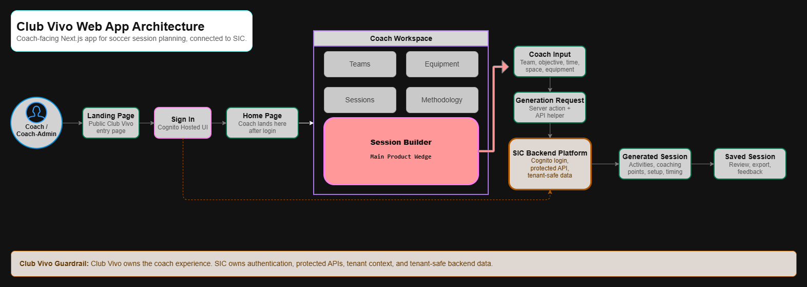
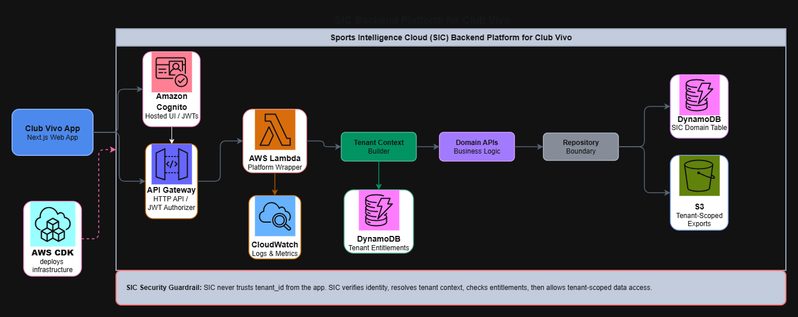

# Club Vivo

Club Vivo is a web app for nonprofit sports organizations.

It starts with a simple idea: coaches should spend less time fighting blank pages and more time helping players learn, move, compete, and enjoy the game.

The first product surface is a soccer session builder that helps coaches create practical training sessions from team context, time, space, equipment, and objective.

## What it does

Club Vivo helps a coach turn real-world constraints into a useful training plan.

A coach can start with:

- who they are coaching
- how much time they have
- what space and equipment they have
- what they want the team to improve

Club Vivo then helps shape a session that is easier to run on the field.

## Current app

This repo currently contains the Club Vivo web app.

Current product surfaces include:

- Coach Workspace
- Session Builder
- Quick Soccer Game
- Saved Sessions
- Feedback and export paths where available

The frontend is built with Next.js.

Club Vivo connects to a private AWS backend for login, protected API access, saved sessions, and tenant-safe data.

## Simple architecture

Club Vivo is intentionally simple on the surface and protected underneath.

At a high level:

- **Next.js** powers the web app.
- **Amazon Cognito** handles login.
- **API Gateway and Lambda** power the backend API.
- **DynamoDB** stores tenant-scoped product data.
- **AWS Amplify** hosts the web app.

The public repo shows the web app. Private backend values stay outside the repo.

## Club Vivo Web App Architecture

Club Vivo is the coach-facing Next.js app. Coaches enter through the landing page, sign in through Cognito, land on the Home page, and work inside the Coach Workspace.

The main product wedge is Session Builder. It turns coach input into a generation request and returns a coach-ready session that can be saved, exported, and improved with feedback.



## Club Vivo and SIC

Club Vivo is the coach-facing web app.

Sports Intelligence Cloud, SIC, is the tenant-safe SaaS platform behind it.

Club Vivo stays simple on the surface, while SIC handles authentication, protected API access, tenant context, data boundaries, exports, observability, and infrastructure.



In practice:

- Club Vivo uses **Next.js** for the web app.
- Club Vivo uses **Cognito Hosted UI** login through private backend configuration.
- Club Vivo stores session tokens in **HttpOnly cookies**.
- Club Vivo calls the protected SIC API with **bearer tokens**.
- SIC verifies identity, resolves tenant context, checks entitlements, and allows tenant-scoped data access.
- Private backend values stay outside this repo.

Architecture docs:

- [Club Vivo on Sports Intelligence Cloud](docs/architecture/club-vivo-on-sic.md)
- [Club Vivo on SIC Mermaid Diagram](docs/architecture/club-vivo-on-sic-mermaid.md)

## Why this matters

Many nonprofit sports organizations do important work with limited time, limited staff, and limited tools.

Club Vivo is built to support those organizations with practical software that is simple enough for real coaches and structured enough to grow into a stronger sports intelligence platform over time.

## Private configuration

Club Vivo connects to a private AWS backend.

Local and production configuration are handled outside the repo. Real values are never committed.

Developers can use `.env.example` as a blank local template when needed. Amplify stores production values privately in its environment settings.

## Development

```bash
npm ci
npm run dev
```