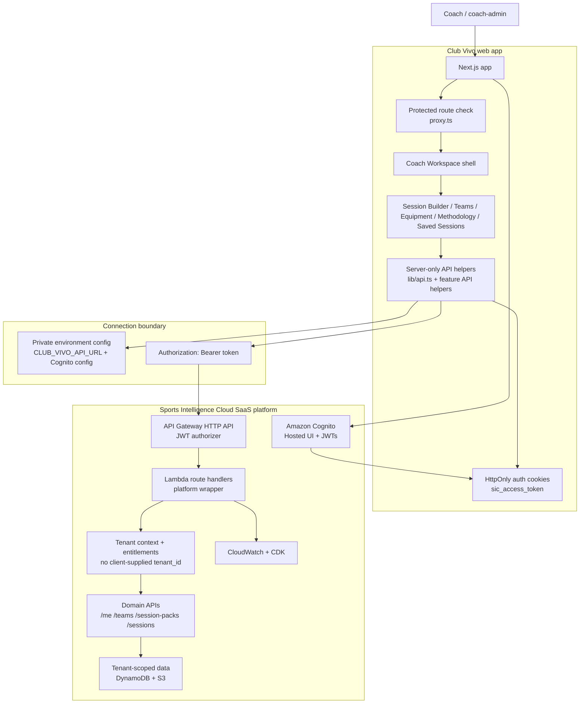

# Club Vivo on SIC Mermaid Diagram

## Purpose

This diagram shows how the public Club Vivo web app connects to Sports Intelligence Cloud, SIC.

## Reading the diagram

Club Vivo owns the coach experience: the web app, workspace, product screens, forms, and frontend helpers.

SIC owns the protected SaaS backend behavior: authentication, API entry, Lambda route handling, tenant context, tenant-safe data access, exports, and operations.

The connection happens through Cognito login, HttpOnly cookies, private environment configuration, and bearer-token API calls.